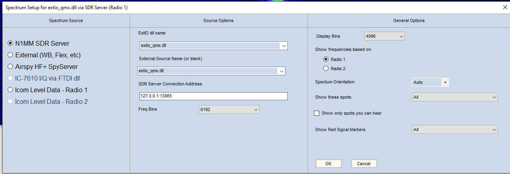
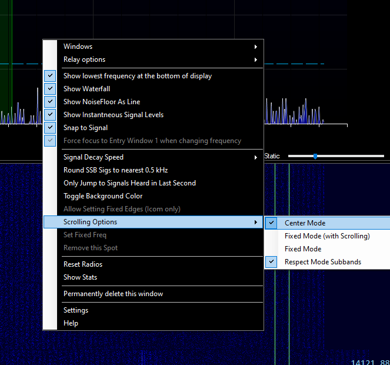

# Extio.dll for QRP Labs QMX I/O Output

## Background

QMX has an I/Q output mode in which the I/Q samples can be streamed via its virtual USB soundcard. HDSDR already supports using soundcard as I/Q stream source. However, the famous contest logger N1MM Logger+ doesn't support soundcard-based SDR. It does, however supports generic Winrad `extio.dll`-based SDR. This project is for creating an `extio.dll` to stream I/Q samples from QMX's virtual soundcard so we can use it in N1MM Logger+'s built-in spectrum display.

## How it works

The code relies on [PortAudio](https://www.portaudio.com/) to stream left and right channels from a soundcard. In our case, it only picks a soundcard which has string `QMX` or `QDX` in its name. Every time when there are 512 incoming frames available, the entire buffer will be passed to N1MM for spectrum display.

QMX has an IF offset at 12kHz, so its actual LO is 12kHz below the tune frequency. When it's in CW mode, the LO is 700Hz lower further. But there's no way to configure such offset in N1MM, so I figured out a workaround here. Whenever N1MM tries to set the SDR to a new LO frequency (via `SetHWLO()`), I save the value and when it queries the actual LO frequency (via `GetHWLO()`), I return the saved value minus 12700Hz. This way, the spectrum display will have the correct frequency marks.

Everything else in the code is just boilerplate and pretty straightforward.

## How to use

Download the `extio_qmx.dll` file [here](https://github.com/spicahan/extio_qmx/releases/download/v0.1/extio_qmx.dll) or build it from source.

Place the `extio_qmx.dll` file inside the N1MM Logger+ installation directory (usually it's `C:\Program Files (x86)\N1MM Logger+`). 

Disconnect your QMX from your computer first. Enable your QMX's I/Q mode and restart it. Reconnect QMX to your computer. Make sure it's in CW mode, not Digi.

Follow the N1MM Logger+ configuration instructions: [N1MM SDR Server – For radios with Extio dll support – THIS IS THE PREFERRED METHOD FOR SDRPlay and Airspy HF+/Discovery SDRs](https://n1mmwp.hamdocs.com/manual-windows/spectrum-display-window/#n1mm-sdr-server-for-radios-with-extio-dll-support-this-is-the-preferred-method-for-sdrplay-and-airspy-hf-discovery-sdrs).

Run N1MM Logger+. Start `Spectrum Display` from `Window` menu. Click the gear icon on the top right to open the spectrum setup window. Select `N1MM SDR Server` in the `Specturm Source` section. Select `extio_qmx.dll` in the `Source Options` section.

I configure the `Freq Bins` to 8192 and `Display Bins` to 4096. You might want to change them to fit your needs.



Close the spectrum setup window. Right click on the main body of the spectrum display. Under `Scrolling Options`, select `Center Mode`.




That's pretty much it. Now you can change frequency from 3 places - from the spectrum display, from the logger main window, or from QMX.

## **NO TX in I/Q Mode!**

Remember, **when in I/Q mode, your QMX won't TX and there's no audio coming out from the headphone jack**. So this project right now is not super useful - it only gives a taste of what it would look like eventually. However, I'm considering creating a slightly different version of `extio.dll` to **work with QMX that's in non-I/Q mode**. When I/Q is disabled, you can TX. When it's in Digi mode, you can get a 3kHz-wide bandwidth in USB (upper sideband). It's quite narrow for spectrum display, but it's better than nothing. Stay tuned!

## How to build

Since N1MM Logger+ is a 32-bit program, we have to use 32-bit toolchain. I use `mingw32` in `msys2`. Download it using [msys2](https://www.msys2.org/). On a 64-bit Windows system, the required toolchain is `mingw-w64-i686-toolchain`.

Follow [PortAudio's instruction](https://files.portaudio.com/docs/v19-doxydocs/compile_windows_mingw.html) to build `portaudio` first.

To build the `extio.dll` itself, under `mingw32`'s environment, use the command below to compile:

```
g++ -Wall -shared -o extio_qmx.dll extio_qmx.cpp -lportaudio "-Wl,--kill-at"
```
